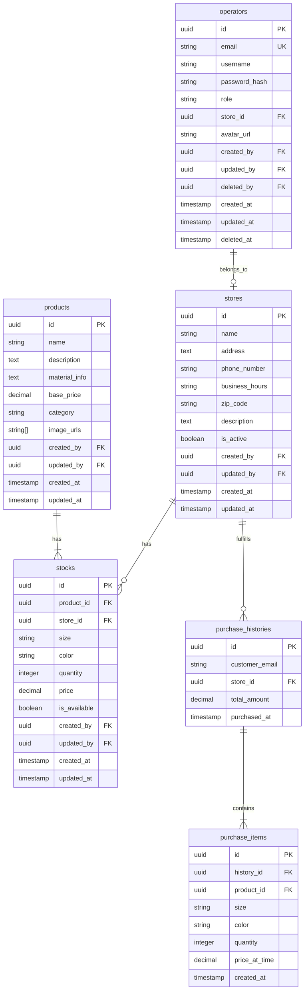

# go-rust-comparison

Golangバックエンド技術検証用リポジトリ

## アプリケーション構成

[-000000?style=for-the-badge&logo=next.js&logoColor=white)](https://nextjs.org/)

- フロントエンド: Next.js(app router) + shadcn/ui
- バックエンド: Gin（Golang）
- データベース: PostgreSQL
- プロキシ: Nginx

## 要件

esaから一部抜粋↓

---

## 概要（ざっくり）

ECサイトの管理側、在庫管理システムを構築する。 
店舗別に管理者が存在し、自身の商品や購入履歴を管理できる。 
（ECサイトは余力があれば作成するかも）

## 利用ユーザ

- **店舗管理者**（例: 東京店、大阪店、名古屋店...）
  - 自身の店舗に関わる商品・購入履歴などを管理できる。
  - 他店の情報は閲覧不可。
- **システム管理者**
  - 全店の情報を管理できる。
  - オペレータの情報も閲覧・編集可。

## テーブル設計（イメージ）

## 機能分担

### 1. **認証・権限管理機能**

- 関連テーブル：`operators`テーブルを構築（`stores`を参照）
- 主な操作：
  - オペレーターのCRUD
  - ログイン、ログアウト認証
- 認証・権限要件：
  - システム管理者は全てのオペレーター情報にアクセス可能とする
  - 店舗管理者は自身の情報のみ参照・更新可能とする
  - パスワードポリシーは以下を満たすこと：
    - 最低8文字以上
    - 英大文字・小文字・数字・記号を含む
  - ~~アカウントロックは5回連続の認証失敗で発生するものとする~~　（**※余力あればでOK**）

### 2. **商品管理機能**

- 関連テーブル：`products`テーブルを構築（`stocks`を参照）
- 主な操作：
  - 商品情報のCRUD
  - 画像が必要なので注意
  - 商品一覧・詳細表示
- 認証・権限要件：
  - システム管理者：全商品のCRUD操作が可能
  - 店舗管理者：
    - 自店舗に紐づく商品情報のCRUD操作が可能
  - 画像アップロードは5MB以下のJPEG/PNG形式のみ許可する

### 3. **在庫管理機能**

- 関連テーブル：`stocks`テーブルを構築（`products`, `stores`を参照）
- 主な操作：
  - 在庫数の更新
  - 店舗別在庫管理
  - 在庫一覧表示
- 認証・権限要件：
  - システム管理者：全店舗の在庫情報の参照・更新が可能
  - 店舗管理者：
    - 自店舗の在庫情報のみ参照・更新可能
    - 他店舗の在庫情報は参照不可
  - 在庫数更新操作はログを記録し、更新者の追跡を可能とする

### 4. **店舗管理機能**

- 関連テーブル：`stores`テーブルを構築（`operators`を参照）
- 主な操作：
  - 店舗情報のCRUD
  - 店舗一覧表示
  - 店舗管理者の割り当て
- 認証・権限要件：
  - **システム管理者のみがアクセス可能な機能とする**
  - 以下の操作を許可する：
    - 店舗情報のCRUD操作
    - 店舗管理者の割り当て・変更
  - 店舗の削除は、関連する在庫データが存在しない場合のみ可能とする

### 5. **購入履歴管理機能**

- 関連テーブル：`purchase_histories`, `purchase_items`を構築
- 主な操作：
  - 購入履歴の参照
  - ~~店舗別売上確認~~ **（※余力あればでOK）**
- 認証・権限要件：
  - システム管理者：全店舗の購入履歴を参照可能
  - 店舗管理者：
    - 自店舗の購入履歴のみ参照可能
    - 過去3年分のデータまでアクセス可能
  - 個人情報（メールアドレス等）は一部マスキング処理を行う
